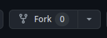
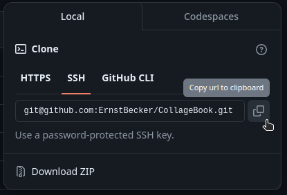

<h1 align="center"><a href="https://collagebook.netlify.app/">Collage Book 📖</a></h1>
<p align="center">Projeto feito pelos alunos do Código Brazuca</p>

<h2 align="center">Como fazer parte?</h2>

Primeiro você precisa criar um fork do projeto clicando no botão fork na parte de cima



Assim que você criar o fork, ele criará um repositório no seu nome, que te levará ao link neste modelo: https://github.com/SEU_NOME/CollageBook. Chegando no link  do seu repositório, clique na opção   "Code" e escolha a opção SSH e copie o URL (Pode-se ser feito clicando no botão de copiar ao lado do URL)




Após fazer todos esses passos, clone o repositório para um diretório de sua escolha
```bash
git clone git@github.com:SEU_NOME/CollageBook.git
```
```bash
cd CollageBook
```

<h2 align="center">Fazendo sua parte</h2>

No arquivo index.html, você irá encontrar uma lista não ordenada. Você neste arquivo irá criar um novo li com uma âncora como no código abaixo.

```html
<li>
  <a style="color: #ff0043" href="pages/ernstbecker/index.html">Ernst Becker</a>
</li>
```

Dentro da tag de âncora, você terá que referenciar o caminho do seu arquivo HTML, que você irá criar na pasta ./pages como no exemplo acima. Criando a pasta dentro do /pages, você irá criar a pasta com o seu nome e adicionar as estruturas básicas de HTML dentro, como o index.html, style.css e **TALVEZ** um arquivo script.js.

```html
...<a href="pages/SEU_NOME/index.html">...
```

<h2 align="center">Publicando sua parte do projeto</h2>

Adicione os arquivos modificados
```bash
git add .
```


Faça um comentário dizendo o que você editou nos arquivos
```bash
git commit -m "Escreva seu comentário aqui"
```

E lance a atualização com o seguinte comando
```bash
git push
```
